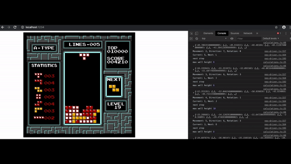

## NES TETRIS AI

### Running

-   download Classic Tetris NES rom (I'm not sure about licensing of 30yo+ games, so I'm not including it in the repo. It's [very easy to find though](https://www.google.com/search?q=tetris+nes+rom))
-   save it as `public/roms/tetris.nes`
-   `npm i`
-   `npm run start`

### Moar

-   It's possible to move all the calculations to the Worker by setting `WORKER` to `true` in `src/connfig.ts`.
-   The algorithm isn't optimized for speed yet, so the non-blocking Worker version doesn't really work as expected
-   To skip the loading screen on each refresh start the game, pause it right after the first tetramino is visible (`Q`) and run `nes.save(0)` in the console. `index.ts` will load previously saved state if available.
-   The best result I get so far was ~517k points, what was more than enough to qualify to [Classic Tetris World Championship](https://thectwc.com/) last year. 2019 threshold was ~650k, so we're not there yet ;).
-   **Feel free to open pull requests with improvements**.
